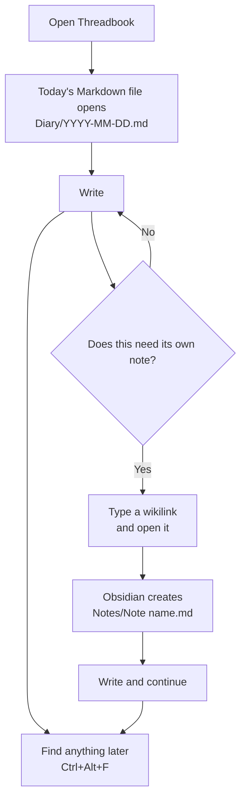

# Threadbook

Threadbook is a no-bullshit, privacy-conscious [Obsidian](https://obsidian.md/) starter vault. Daily notes provide a continuous timeline, ordinary notes live in one flat folder, and wikilinks connect everything. Open it, write, link when useful, and carry on.

The repository tracks the reusable structure, templates, settings, and CSS snippets. Personal notes, diary entries, and attachments are excluded from Git so they can be synchronized separately using Proton Drive or another private storage provider.

## The no-bullshit approach

- Open the vault and start writing.
- Get one Markdown file per day in `Diary`.
- Write directly in that daily note.
- When something deserves its own note, type `[[Note name]]` and open the link.
- Let Obsidian create the new Markdown file in the flat `Notes` folder.
- Find information later through wikilinks or `Ctrl+Alt+F` search.
- Keep private writing out of the public Git history.

There are no categories to maintain, no frontmatter forms to complete, no mandatory tags, and no nested folder hierarchy to reorganize. That absence is intentional. Filing and metadata may feel harmless with ten notes, but both become recurring maintenance across thousands of notes. Threadbook removes that maintenance from the workflow.

## Workflow



That is the complete system: **daily note → write → link when needed → search later**.

## Vault layout

```sh
Threadbook/
├── Diary/                    # Daily notes; ignored by Git
├── Notes/                    # Ordinary notes; ignored by Git
├── Attachments/              # Images and other attachments; ignored by Git
├── Extras/
│   └── Templates/            # Reusable Templater templates
├── .obsidian/                # Shared, reviewable Obsidian configuration
├── .gitignore
└── README.md
```

`Diary` and `Notes` contain tracked `.gitkeep` files so the directories remain present in fresh copies of the repository. Files created inside them remain private by default.

## Getting started

1. Install [Obsidian](https://obsidian.md/download).
2. Clone or download this repository.
3. In Obsidian, select **Open folder as vault** and choose the `Threadbook` directory.
4. Open **Settings → Community plugins**, turn off Restricted Mode after reviewing the plugins below, and install the required plugins.
5. Reload Obsidian after installing the plugins.
6. If necessary, open **Settings → Appearance → CSS snippets** and enable the included snippets.

Community-plugin executable files are deliberately not stored in this repository. Install plugins from their original sources so that Obsidian can manage updates normally.

## Daily workflow

Threadbook is configured to open today's daily note whenever the vault opens. Daily notes are stored in `Diary` with Obsidian's default `YYYY-MM-DD` filenames.

The daily-note template adds links to the previous and following dates:

```markdown
[[2026-07-19]] | [[2026-07-21]]

---

# Logs
```

Use the note for quick capture, a short log, or links to larger notes. Type `[[Note name]]`, follow the unresolved wikilink, and Obsidian creates the connected Markdown file in `Notes`. Write the note and leave it there—no filing, tagging, or metadata pass follows.

Ordinary new notes are configured to go into `Notes`. Attachments go into an `Attachments` subfolder relative to the current note.

## Keyboard shortcuts

On Windows and Linux, `Mod` means `Ctrl`; on macOS it means `Command`.

| Action                         | Shortcut                                                   |
| ------------------------------ | ---------------------------------------------------------- |
| Open today's daily note        | `Mod+D`                                                    |
| Search the vault with CFR Find | `Ctrl+Alt+F` on Windows/Linux; `Command+Option+F` on macOS |
| Open the command palette       | `Mod+P` or `Mod+Shift+P`                                   |
| Toggle the left sidebar        | `Mod+Shift+B`                                              |
| Reset zoom                     | `Mod+0`                                                    |
| Zoom in                        | `Mod+=`                                                    |
| Zoom out                       | `Mod+-`                                                    |

## Plugins

Threadbook intentionally uses a small plugin set:

- [Hide Folders](https://github.com/jonasdoesthings/obsidian-hide-folders) hides supporting folders such as `Extras` from the file explorer without deleting their contents.
- [Sort and Permute Lines](https://github.com/vinzent03/obsidian-sort-and-permute-lines) sorts lines alphabetically or by length, reverses or shuffles lines, and can sort headings while preserving their hierarchy.
- [Linter](https://github.com/platers/obsidian-linter) applies consistent Markdown formatting. This vault is configured to lint on save.
- [Templater](https://github.com/silentvoid13/Templater) generates the previous/next daily links, positions the cursor, and supports the ordinary-note template.
- [CFR Find](https://github.com/cferrugem/obsidian-cfr-find) provides fast, typo-tolerant vault search using a local worker-powered index.

The first four plugins can be installed through Obsidian's Community plugins browser. CFR Find currently requires manual installation: download or build its release files, place `main.js`, `manifest.json`, and `styles.css` in `.obsidian/plugins/cfr-find/`, reload Obsidian, and enable the plugin.

Only use plugins and templates that you trust. Templater can execute JavaScript and, when explicitly enabled, system commands. System commands are disabled in the supplied configuration.

## Templates

Templates live in `Extras/Templates`:

- `daily_notes_template.md` creates the previous/next date navigation and a `Logs` heading.
- `notes_template.md` creates a titled ordinary note and positions the cursor for writing.

Templater is configured to run when new files are created and to jump to the template's cursor marker automatically.

## Privacy and synchronization

Git ignores the contents of:

- `Diary/`
- `Notes/`
- `Attachments/`
- `.trash/`

It also ignores personal workspace state, caches, downloaded plugin executables, and common temporary files. Templates, CSS snippets, selected Obsidian settings, and plugin configuration remain eligible for version control.

This boundary applies only to the listed folders. A private note created in the vault root or under `Extras` can appear in `git status` and may be committed accidentally. Always review changes before publishing:

```powershell
git status --short
git diff --cached
```

Git is used here to distribute and evolve the vault structure—not to back up private content. Synchronize the complete local vault with Proton Drive or another private service for personal backup. Avoid editing the same note simultaneously on multiple devices, and allow synchronization to finish before switching devices.

## Customizing Threadbook

Everything remains ordinary Markdown. You can change the folder names, templates, shortcuts, plugins, and CSS without converting your notes to a proprietary format. If you rename a private-content folder, update `.gitignore` before placing notes in it.

The bundled appearance references **FiraCode Nerd Font Mono**. Obsidian will fall back to an available font if it is not installed.
